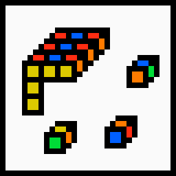
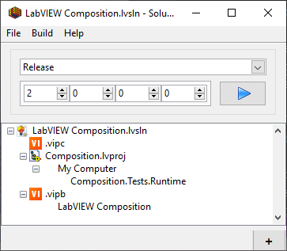
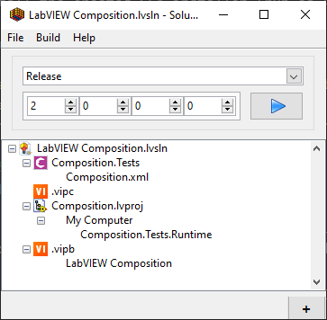
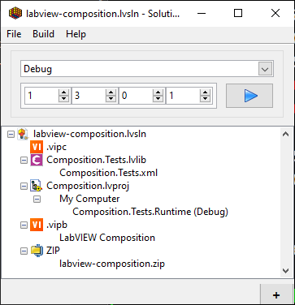

<!-- Based on https://github.com/othneildrew/Best-README-Template -->
<!-- PROJECT SHIELDS -->
<!--
*** I'm using markdown "reference style" links for readability.
*** Reference links are enclosed in brackets [ ] instead of parentheses ( ).
*** See the bottom of this document for the declaration of the reference variables
*** for contributors-url, forks-url, etc. This is an optional, concise syntax you may use.
*** https://www.markdownguide.org/basic-syntax/#reference-style-links
-->
[![Contributors][contributors-shield]][contributors-url]
[![Forks][forks-shield]][forks-url]
[![Stargazers][stars-shield]][stars-url]
[![Issues][issues-shield]][issues-url]
[![BSD-3-Clause License][license-shield]][license-url]

<!-- PROJECT LOGO -->
<br>
<p align="center">
  <a href="https://github.com/logmanoriginal/solution-explorer-extensions">
    
  </a>

  <h3 align="center">Solution Explorer Extensions</h3>

  <p align="center">
    Addtional build items for <a href="https://www.mooregoodideas.com/products/solution-explorer/">Solution Explorer</a>.
    <br>
    <a href="https://github.com/logmanoriginal/solution-explorer-extensions"><strong>Explore the docs »</strong></a>
    <br>
    <br>
    <a href="https://github.com/logmanoriginal/solution-explorer-extensions">View Demo</a>
    <br>
    <a href="https://github.com/logmanoriginal/solution-explorer-extensions/issues">Report Bug</a>
    <br>
    <a href="https://github.com/logmanoriginal/solution-explorer-extensions/issues">Request Feature</a>
  </p>
</p>

<!-- ABOUT THE PROJECT -->
## About The Project

This project provides additional build items for Solution Explorer:

* **VIPM** - Uses [VI Package Manager](https://vipm.io/) to build packages and apply package configurations.
* **Caraya** - Runs unit tests using [Caraya Unit Test Framework](https://www.vipm.io/package/jki_lib_caraya/).
* **ZIP** - Creates a ZIP archive from build artifacts.

### Built With

* [LabVIEW&trade;](https://www.ni.com/labview)

<!-- GETTING STARTED -->
## Getting Started

To get a local copy up and running follow these simple steps.

### Prerequisites

* LabVIEW&trade; 2019 or later
* VI Package Manager

### Installation

1. Install Solution Explorer (follow the [installation instructions](https://www.mooregoodideas.com/products/solution-explorer/index.html#distribution-and-installation))
2. Clone the repo
   ```sh
   git clone https://github.com/logmanoriginal/solution-explorer-extensions.git
   ```
3. Install dependencies
   ```sh
   start .vipc
   ```
   Or apply `.vipc` manually.
4. Copy the following files from the Solution Explorer plugin folder into the `libs` folder
   * `Solution.lvlibp`
   * `Project.lvlibp`
5. Build the solution (`Solution Explorer Extensions.lvsln`)
6. Install the created SFX installer (run as Administrator)

**Important**

By default the SFX installer does not overwrite files in the plugin folder. To upgrade plugins, either delete the files from the plugin folder manually (recommended) or allow the installer to overwrite the files.

<!-- USAGE EXAMPLES -->
## Usage

### VIPM

Simply drag your configurations (`.vipc`) and build specifications (`.vipb`) into Solution Explorer to include them in your build pipeline.



### Caraya

Add the Caraya build item to your pipeline and select a folder or compatible file type (`.vi`, `.vim`, `.vit`, `.lvproj`, `.lvlib`, `.lvclass`).



### ZIP

Add the ZIP build item to your solution and specify the output file (`.zip`). This will create an archive with build artifacts from the previous build steps.



<!-- ROADMAP -->
## Roadmap

See the [open issues](https://github.com/logmanoriginal/solution-explorer-extensions/issues) for a list of proposed features (and known issues).

<!-- CONTRIBUTING -->
## Contributing

Contributions are what make the open source community such an amazing place to be learn, inspire, and create. Any contributions you make are **greatly appreciated**.

1. Fork the Project
2. Create your Feature Branch (`git checkout -b feature/AmazingFeature`)
3. Commit your Changes (`git commit -m 'Add some AmazingFeature'`)
4. Push to the Branch (`git push origin feature/AmazingFeature`)
5. Open a Pull Request

Keep in mind that LabVIEW&trade; VIs are binary files, which are difficult to merge.
- Only change a single VI or library.
- Avoid conflicts with other pull requests (don't work on the same libraries or VIs).
- Send VI Snippets (via issues) instead of pull requests when possible.

<!-- LICENSE -->
## License

Distributed under the BSD-3-Clause License. See [`LICENSE`](LICENSE.txt) for more information.

<!-- CONTACT -->
## Contact

Project Link: [https://github.com/logmanoriginal/solution-explorer-extensions](https://github.com/logmanoriginal/solution-explorer-extensions)

<!-- ACKNOWLEDGEMENTS -->
## Acknowledgements

* [MGI Solution Explorer](https://gitlab.com/mgi/Solution-Explorer)
* [MGI Toolkits](https://www.vipm.io/publisher/mgi/)
* [JKI VIPM API](https://www.vipm.io/package/jki_lib_vipm_api/)
* [Caraya Unit Test Framework](https://www.vipm.io/package/jki_lib_caraya/)

<!-- MARKDOWN LINKS & IMAGES -->
<!-- https://www.markdownguide.org/basic-syntax/#reference-style-links -->
[contributors-shield]: https://img.shields.io/github/contributors/logmanoriginal/solution-explorer-extensions.svg?style=for-the-badge
[contributors-url]: https://github.com/logmanoriginal/solution-explorer-extensions/graphs/contributors
[forks-shield]: https://img.shields.io/github/forks/logmanoriginal/solution-explorer-extensions.svg?style=for-the-badge
[forks-url]: https://github.com/logmanoriginal/solution-explorer-extensions/network/members
[stars-shield]: https://img.shields.io/github/stars/logmanoriginal/solution-explorer-extensions.svg?style=for-the-badge
[stars-url]: https://github.com/logmanoriginal/solution-explorer-extensions/stargazers
[issues-shield]: https://img.shields.io/github/issues/logmanoriginal/solution-explorer-extensions.svg?style=for-the-badge
[issues-url]: https://github.com/logmanoriginal/solution-explorer-extensions/issues
[license-shield]: https://img.shields.io/github/license/logmanoriginal/solution-explorer-extensions.svg?style=for-the-badge
[license-url]: https://github.com/logmanoriginal/solution-explorer-extensions/blob/master/LICENSE.txt
